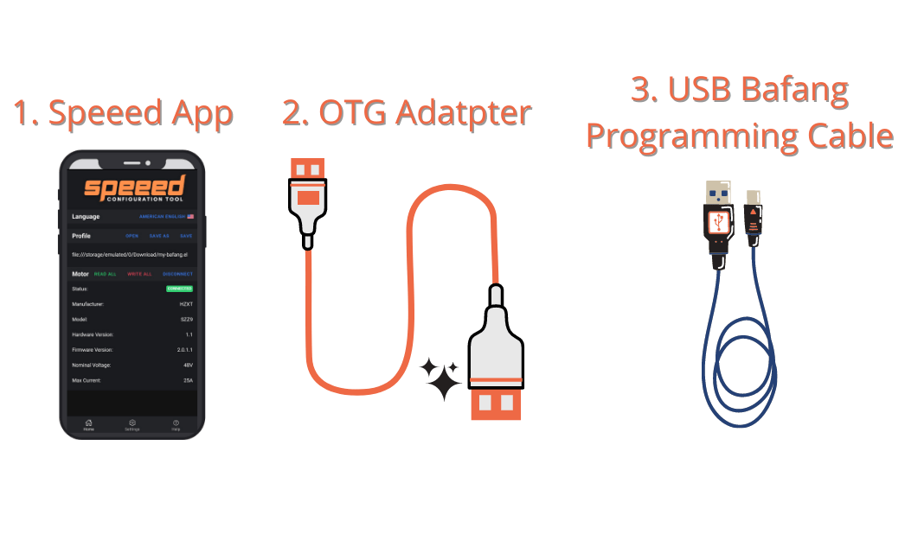
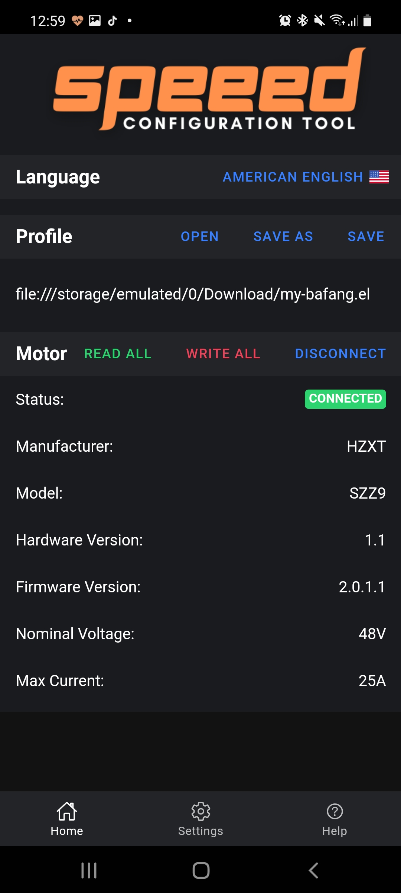
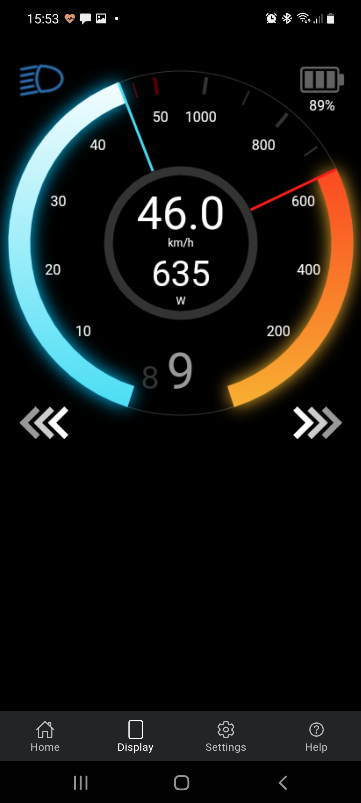
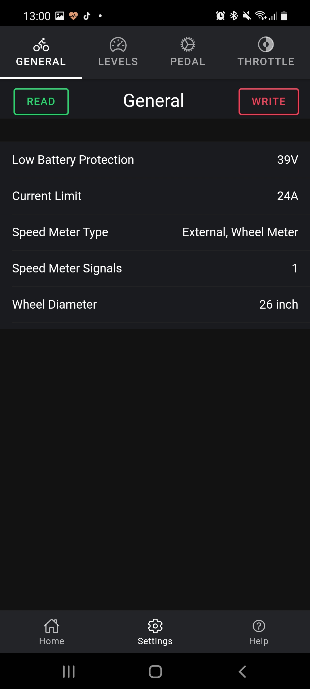
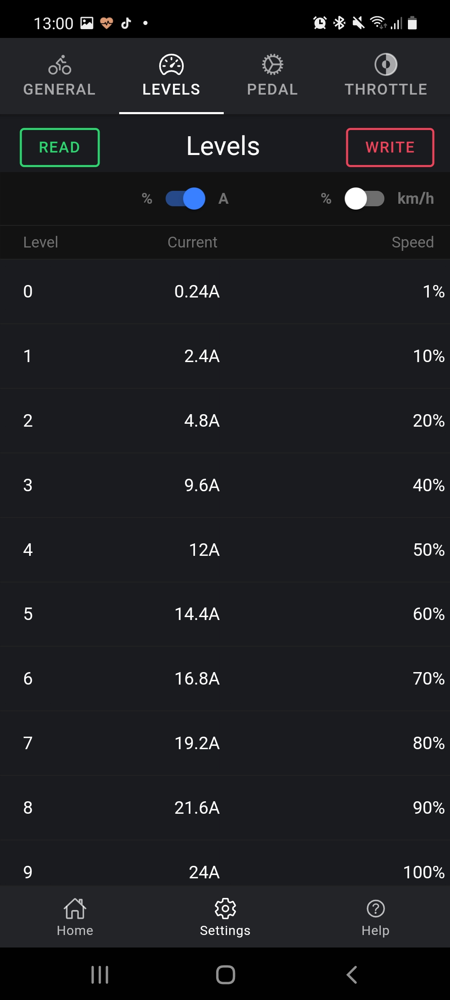

	
	<h1>Speeed Configuration Tool</h1>
	

		<b>Easy and clear programming tool for BAFANG BBS01 BBS02 BBSHD e-bike motors</b>
	

	<form action="https://www.paypal.com/donate" method="post" target="_top">
	<input type="hidden" name="hosted_button_id" value="Q2R6MWNE6EY52" />
	<input type="image" src="https://www.paypalobjects.com/en_US/PL/i/btn/btn_donateCC_LG.gif" border="0" name="submit" title="PayPal - The safer, easier way to pay online!" alt="Donate with PayPal button" />
	
	</form>

## Download

[**Latest release @ Google Play**](https://play.google.com/store/apps/details?id=com.mkopa.speeed)

Requires Android 6.0 or later.

## Connection

	

- Launch the Speeed application
- Plug the OTG adapter into your phone (If you're wondering where to get one, let me calm you down. You probably have one at home, and if not, you can buy one at any phone or computer store for cheap).
- Connect the Bafang programming cable to the OTG adapter [It is available on AliExpress](https://pl.aliexpress.com/wholesale?SearchText=bafang+programming+cable)
- Connect the other end of the cable to where the bike display is connected.
- Click the "Connect" button in the app. That's it!

## Demo

Please turn on the subtitles

## Screenshots

