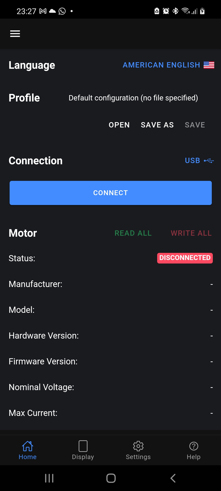
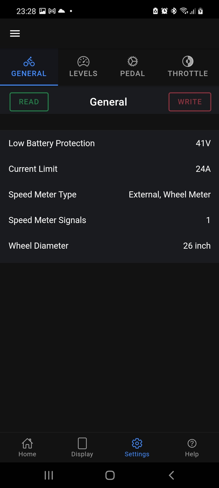
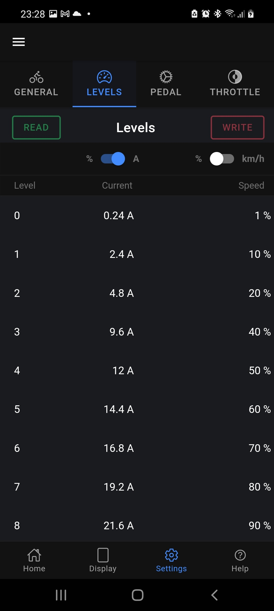
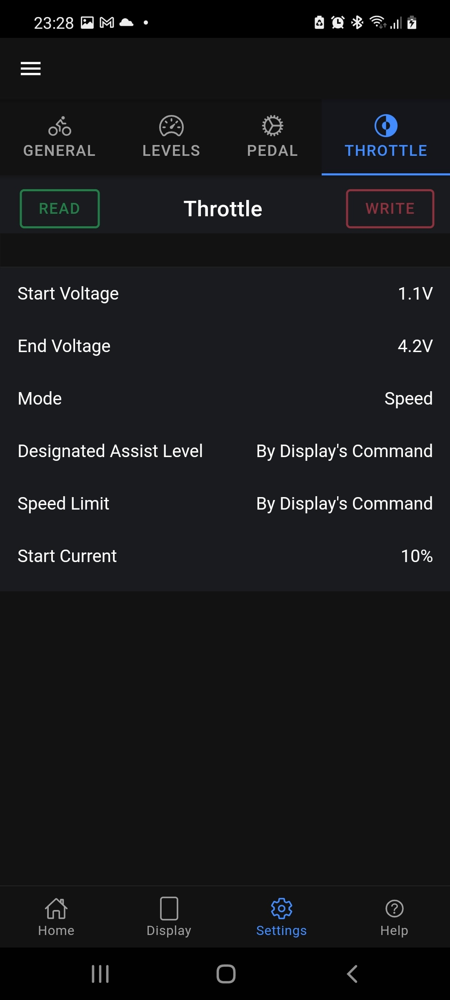
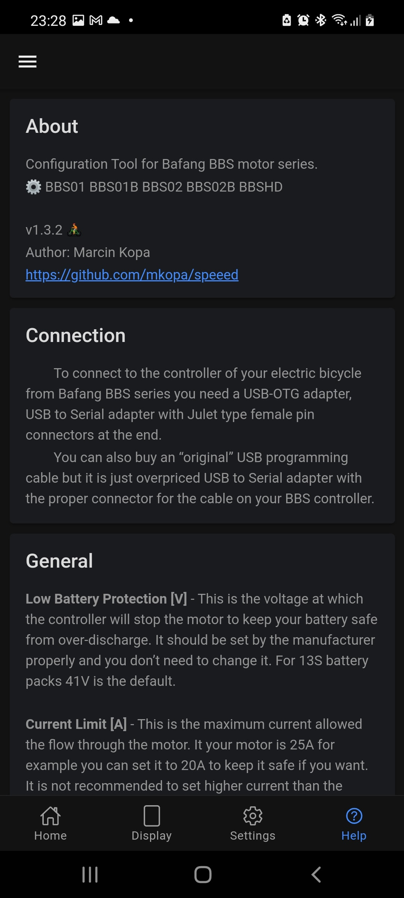
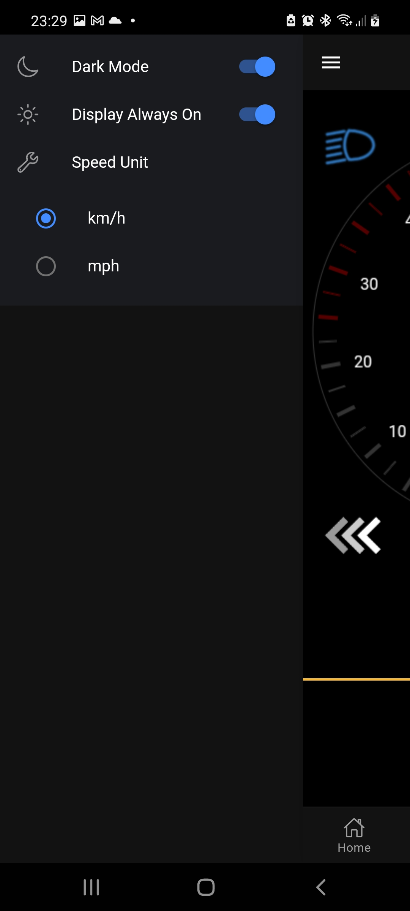
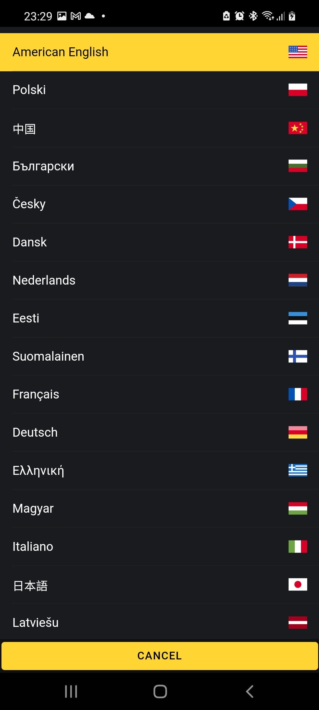

<div align="center">
	
	<h1>Speeed Configuration Tool</h1>
	<p>
		<b>Easy and clear programming tool for BAFANG BBS01 BBS02 BBSHD e-bike motors</b>
	</p>
</div>

## Donate

[](https://ko-fi.com/marcinkopa)
```
[**Buy me a ☕️**](https://ko-fi.com/marcinkopa)

## Download

[**Latest release @ Google Play**](https://play.google.com/store/apps/details?id=com.mkopa.speeed)

Requires Android 6.0 or later.

## Description 

Speeed is the equivalent of the popular Windows app - Bafang Configuration Tool

<div>
    
</div>

Because it is a smartphone app with a clear interface and built-in e-bike display makes this app very comfortable when tuning our e-bike.

Currently the application is only available for Android. However, I am just finishing up testing a small Bluetooth LE adapter that will be ridiculously cheap and have amazing features. Then there will be an app for iOS.

## Connection

<div align="center">
	
</div>

- Launch the Speeed application
- Plug the OTG adapter into your phone (If you're wondering where to get one, let me calm you down. You probably have one at home, and if not, you can buy one at any phone or computer store for cheap).
- Connect the Bafang programming cable to the OTG adapter [It is available on AliExpress](https://pl.aliexpress.com/wholesale?SearchText=bafang+programming+cable)
- Connect the other end of the cable to where the bike display is connected.
- Click the "Connect" button in the app. That's it!

#### Supported motors:

  - BBS01 ✅
  - BBS01B ✅
  - BBS02 ✅
  - BBS02B ✅
  - BBSHD ✅
  - All hub motors from Bafang ✅

## Demo

Please turn on the subtitles

[](https://www.youtube.com/watch?v=6EDEFLhKJrM)

## Screenshots











